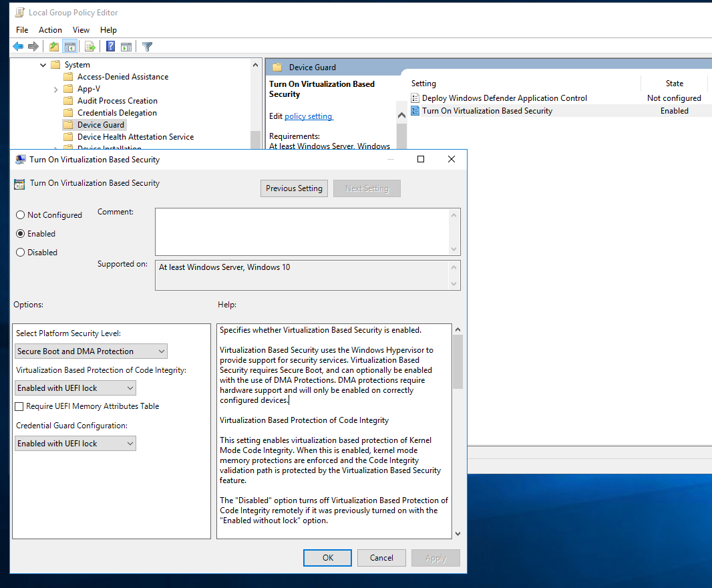

Hangs with Credentials Guard running (LSAIso.exe)
https://blogs.technet.microsoft.com/ash/2016/03/02/windows-10-device-guard-and-credential-guard-demystified/

LSAIso.exe must be running.

More links:
http://woshub.com/virtual-secure-mode-vsm-in-windows-10-enterprise/
https://docs.microsoft.com/en-us/windows/security/identity-protection/credential-guard/credential-guard-manage
http://blog.rewolf.pl
https://github.com/rwfpl/rewolf-wow64ext/